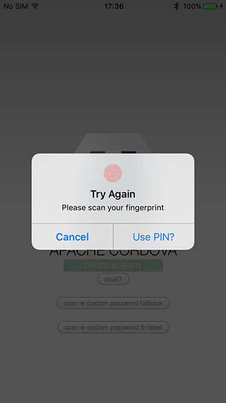

# Cordova TouchID Plugin

> Also works with Face ID on iPhone X 🚀

## Index

1. [Description](#description)
2. [Screenshot](#screenshot) 
3. [Installation](#installation)  
4. [Usage](#usage)  
5. [Security++](#security)  
6. [Face ID support](#face-id-support)

## Description

Scan the fingerprint of your user with the TouchID sensor (iPhone 5S).

* Compatible with [Cordova Plugman](https://github.com/apache/cordova-plugman).
* Minimum iOS version is 8 (error callbacks will be gracefully invoked on lower versions).
* Requires a fingerprint scanner, so an iPhone 5S or newer is required.

## Screenshot
Distorted a bit because I created it back when Apple had not yet released the SDK and they're not a fan of developers posting screenshots of unreleased features.



## Installation

### Automatically (CLI / Plugman)
Compatible with [Cordova Plugman](https://github.com/apache/cordova-plugman), compatible with [PhoneGap 3.0 CLI](http://docs.phonegap.com/en/3.0.0/guide_cli_index.md.html#The%20Command-line%20Interface_add_features), here's how it works with the CLI (backup your project first!):

From npm:
```
$ cordova plugin add cordova-plugin-touch-id
$ cordova prepare
```

The latest, from the master repo:
```
$ cordova plugin add https://github.com/EddyVerbruggen/cordova-plugin-touch-id
$ cordova prepare
```

TouchID.js is brought in automatically. There is no need to change or add anything in your html.

### Manually

1\. Add the following xml to your `config.xml` in the root directory of your `www` folder:
```xml
<feature name="TouchID">
  <param name="ios-package" value="TouchID" />
</feature>
```

You'll need to add the `LocalAuthentication.framework` and `Security.framework` to your project.
Click your project, Build Phases, Link Binary With Libraries, search for and add the frameworks.

2\. Grab a copy of TouchID.js, add it to your project and reference it in `index.html`:
```html
<script type="text/javascript" src="js/TouchID.js"></script>
```

3\. Download the source files and copy them to your project.

iOS: Copy the two `.h` and two `.m` files to `platforms/ios/<ProjectName>/Plugins`

## Usage
First you'll want to check whether or not the user has a configured fingerprint scanner.
You can use this to show a 'log in with your fingerprint' button next to a username/password login form.
```js
window.plugins.touchid.isAvailable(
  function(type) {alert(type)}, // type returned to success callback: 'face' on iPhone X, 'touch' on other devices
  function(msg) {alert('not available, message: ' + msg)} // error handler: no TouchID available
);
```

If the onSuccess handler was called, you can scan the fingerprint.
There are two options: `verifyFingerprint` and `verifyFingerprintWithCustomPasswordFallback`.
The first method will offer a fallback option called 'enter passcode' which shows the default passcode UI when pressed.
The second method will offer a fallback option called 'enter password' (not passcode) which allows you to provide your own password dialog.
```js
window.plugins.touchid.verifyFingerprint(
  'Scan your fingerprint please', // this will be shown in the native scanner popup
   function(msg) {alert('ok: ' + msg)}, // success handler: fingerprint accepted
   function(msg) {alert('not ok: ' + JSON.stringify(msg))} // error handler with errorcode and localised reason
);
```
The errorhandler of the method above can receive an error code of `-2` which means the user pressed the 'enter password' fallback.

```js
window.plugins.touchid.verifyFingerprintWithCustomPasswordFallback(
  'Scan your fingerprint please', // this will be shown in the native scanner popup
   function(msg) {alert('ok: ' + msg)}, // success handler: fingerprint accepted
   function(msg) {alert('not ok: ' + JSON.stringify(msg))} // error handler with errorcode and localised reason
);
```

This will render a button labelled 'Enter password' in case the fingerprint is not recognized.
If you want to provide your own label ('Enter PIN' perhaps), you can use awkwardly named function (added in version 3.1.0):

```js
window.plugins.touchid.verifyFingerprintWithCustomPasswordFallbackAndEnterPasswordLabel(
  'Scan your fingerprint please', // this will be shown in the native scanner popup
  'Enter PIN', // this will become the 'Enter password' button label
   function(msg) {alert('ok: ' + msg)}, // success handler: fingerprint accepted
   function(msg) {alert('not ok: ' + JSON.stringify(msg))} // error handler with errorcode and localised reason
);
```

You can copy-paste these lines of code for a quick test:
```html
<button onclick="window.plugins.touchid.isAvailable(function(msg) {alert('ok: ' + msg)}, function(msg) {alert('not ok: ' + msg)})">Touch ID available?</button>
<button onclick="window.plugins.touchid.verifyFingerprint('Scan your fingerprint please', function(msg) {alert('ok: ' + msg)}, function(msg) {alert('not ok: ' + JSON.stringify(msg))})">Scan fingerprint</button>
```

## "Biometry is locked out" (code: -8)

```js
window.plugins.touchid.askPassword(
   'Enter password', // this will become the 'Enter password' label
   function(msg) {alert('ok: ' + msg)}, // success handler: fingerprint reactivated
   function(msg) {alert('not ok: ' + JSON.stringify(msg))} // error reason as string
);
```


## Security++
Since iOS9 it's possible to check whether or not the list of enrolled fingerprints changed since
the last time you checked it. It's recommended you add this check so you can counter hacker attacks
to your app. See [this article](https://godpraksis.no/2016/03/fingerprint-trojan/) for more details.

So instead of checking the fingerprint after `isAvailable` add another check.
In case `didFingerprintDatabaseChange` returns `true` you probably want to re-authenticate your user
before accepting valid fingerprints again.

```js
window.plugins.touchid.isAvailable(
    // success handler; available
    function() {
      window.plugins.touchid.didFingerprintDatabaseChange(
          function(changed) {
            if (changed) {
              // re-auth the user by asking for his credentials before allowing a fingerprint scan again
            } else {
              // call the fingerprint scanner
            }
          }
      );
    },
    // error handler; not available
    function(msg) {
      // use a more traditional auth mechanism
    }
);
```

## Face ID Support
Since iOS 11, LocalAuthentication also supports Face ID for biometrics. This is
a drop-in replacement for Touch ID and any existing apps using Touch ID will
work identically on devices that use Face ID.

Since plugin version 3.3.0 the success callback of `isAvailable` receives
the type of biometric ID, which is either `touch` or `face`.

You can use this to display "Face ID" or "Touch ID" as appropriate in your app.

```js
window.plugins.touchid.isAvailable(
  function(type) {alert(type)}, // type returned to success callback: 'face' on iPhone X, 'touch' on other devices
  function(msg) {alert('not available, message: ' + msg)} // error handler: no TouchID available
);
```

If you want to alter the usage description in the consent popup, then override the
default empty adds an empty `NSFaceIDUsageDescription`. To do so, pass the following variable when installing the plugin:

```
cordova plugin add cordova-plugin-touch-id --variable FACEID_USAGE_DESCRIPTION="For easy authentication"
```
